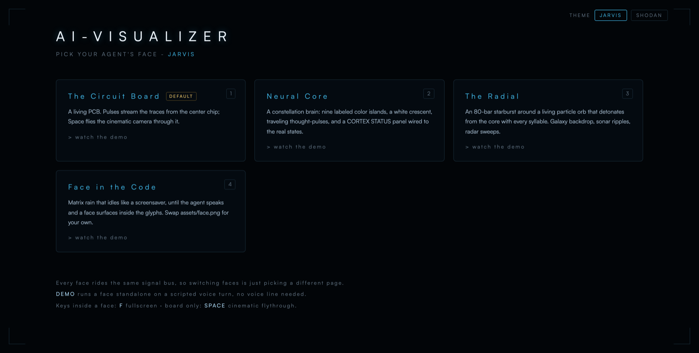
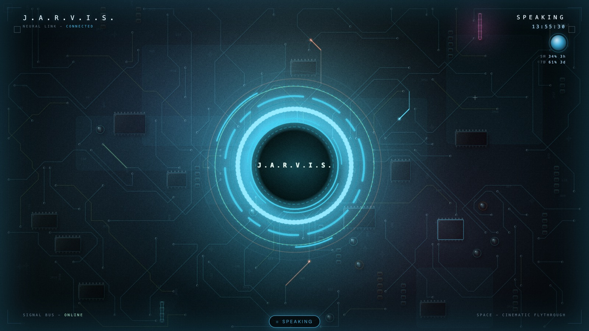
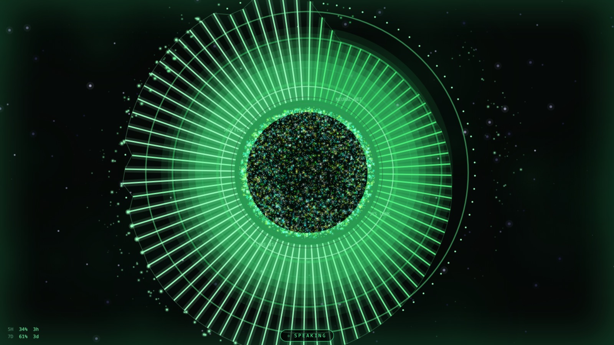
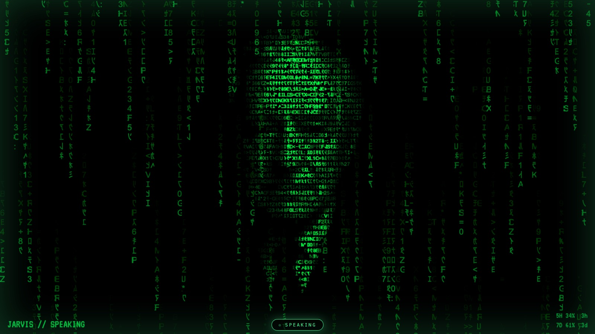
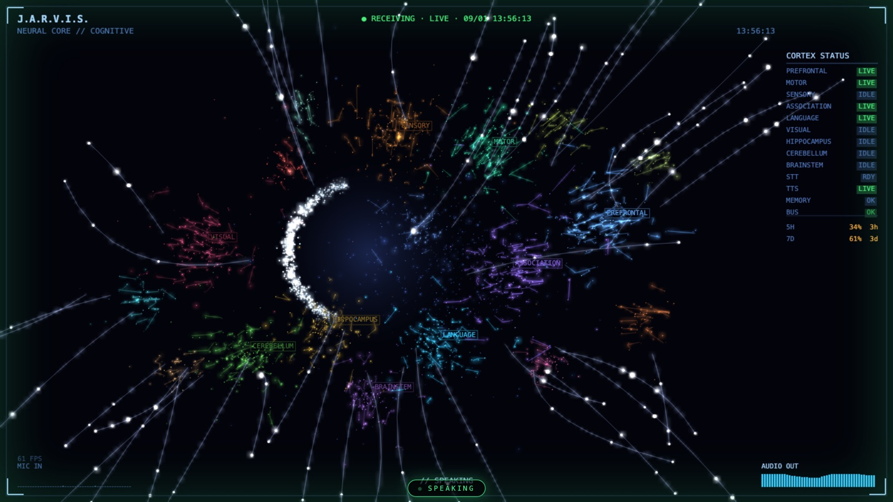
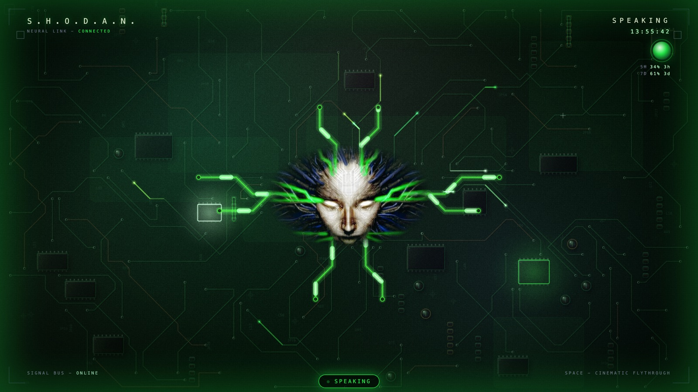

# ai-visualizer stack

**Give your AI agent a face, a voice, hands, and a memory.** One repo, one
clone, one install command.

Upstream ships these as five separate repositories. This mirror absorbs them as
folders so a single `git clone` gets the whole thing and nothing breaks if a
component repo moves.



---

## Install

**You need:** [Claude Code](https://claude.com/claude-code), Python 3 (ships
with macOS and most Linux), and a browser. macOS and Linux are the tested
paths; Windows works with `run.bat` in place of `run.sh`.

### The whole stack, guided

```bash
git clone https://github.com/rg1989/ai-visualizer
cd ai-visualizer/fullstack-agent && claude "set me up"
```

A wizard runs inside Claude Code. It asks which pieces you want, installs only
those, wires them to each other, and never touches a config you already have.
You do **not** have to take all of it.

### Just the face, in 30 seconds

No wizard, no AI, no voice line — this runs on its own:

```bash
git clone https://github.com/rg1989/ai-visualizer
cd ai-visualizer/ai-visualizer && ./run.sh --mock speaking
```

A browser opens on a face performing a synthetic conversation. That is the
whole install; there is no build step and no dependencies. Drop the `--mock`
flag and it waits for a real voice line instead.

Prefer to be walked through the config? Open the `ai-visualizer` folder in
Claude Code and say *"read ai-visualizer.md and set me up."*

---

## How it works

Everything hangs off a **signal bus**: three tiny files in a folder. Whatever
writes them drives the face — that is the entire contract.

```
.voice_state        idle | listening | thinking | speaking
.voice_waveform     JSON {ts, samples: [64 floats]} while audio plays
.voice_loading_pid  exists while the voice line plays a thinking sound
```

```
   you speak  ──▶  backtalk  ──writes──▶  .voice_state       your agent
                  (the voice)             .voice_waveform    (Claude Code)
                                                │                  │
                                                │ 8x/sec poll      │ writes cards
                                                ▼                  ▼
                                          ai-visualizer  ◀──── bin/glass.sh
                                            (the face)
```

- **backtalk** listens, transcribes, talks to your agent, and speaks the reply
  out loud — writing the bus files as it goes.
- **ai-visualizer** serves the faces and polls `/state` eight times a second.
  It never talks to your agent directly; it just renders whatever the bus says.
- **The glass** is the card layer over the face — notes, maps, timers, a music
  player. Your agent puts things there by running `ai-visualizer/bin/glass.sh`.
- **barehands** watches a webcam and moves a pointer, so you can touch the
  glass without a mouse.

Because the contract is three files, anything can drive a face. A shell script
that writes `speaking` into `.voice_state` is a valid voice line.

**No voice line yet?** Every face has a demo: click *watch the demo* in the
gallery, or add `?demo=1` to a face URL. `?demo=1&state=speaking` pins a state
so you can stare at it.

---

## The faces

Four ship, and every one rides the same bus — switching face is just opening a
different page. The gallery at the root URL lists them with one-click demos.

| | |
|---|---|
| **The Circuit Board** — a living PCB; pulses stream the traces from the centre chip, and `Space` flies a cinematic camera through it. | **The Radial** — an 80-bar starburst around a particle orb that detonates from the core with every syllable. |
|  |  |
| **Face in the Code** — matrix rain that idles like a screensaver until the agent speaks and a face surfaces in the glyphs. | **Neural Core** — a constellation brain: nine labelled colour islands, travelling thought-pulses, a CORTEX STATUS panel wired to the real states. |
|  |  |

Inside a face: **F** fullscreen, **Esc** settings, **Space** flythrough (board
only).

---

## Themes are folders

A theme is a directory. Drop it in and it is in the picker on the next reload;
delete it and it is gone. Nothing tracked lists the themes you have, so one you
want to keep to yourself stays private behind a single `.gitignore` line.

```
ai-visualizer/themes/mytheme/
    theme.js          AVTheme.add("mytheme", { label, face, css, canvas })
    MyFont.ttf        assets live in the folder, so it is copyable
```

Two ship. Same face, same code, same moment — only the theme differs:

| JARVIS | SHODAN |
|---|---|
|  |  |

A theme sets the palette for the whole system at once — face, glass cards, chat
crawl and avatars — and pairs itself to a face, so picking one dresses
everything. `ai-visualizer/themes/README.md` is the full contract; zipping a
folder is how you hand a theme to someone else.

---

## What is in this repo

| Folder | What it is |
|---|---|
| **[ai-visualizer](ai-visualizer/)** | The face, the glass, the themes. Python 3 + a browser; works with any AI. |
| **[backtalk](backtalk/)** | The voice: wake word, speaker ID, voice characters. Claude Code only. |
| **[barehands](barehands/)** | The hands: webcam hand-tracking that drives a pointer. Any AI. |
| **[ai-memory-vault](ai-memory-vault/)** | The memory: an Obsidian-shaped vault and the conventions for keeping it. |
| **[fullstack-agent](fullstack-agent/)** | The installer — the wizard the command above runs. |
| **[components](components/)** | Glass components: data in, a finished themed card out. |
| **[skills](fullstack-agent/household/skills/)** | Agent skills for driving the glass. |
| **[launchers](launchers/)**, **[schedules](schedules/)** | macOS launchers and scheduled jobs. |
| **[GLASS-SPEC.md](GLASS-SPEC.md)**, **[HANDS-SPEC.md](HANDS-SPEC.md)** | The contracts the glass and the hands are built to. |

Each folder keeps its own README and TROUBLESHOOTING — read the one for the
piece you care about. `update.sh` in any folder updates the whole mirror, since
here they are one repo.

---

## Credit and licence

Every component is the work of **Jared Rhodenizer** — <https://jaredrhod.com>,
upstream at <https://github.com/jaredrhod>. This repository mirrors that work
with local changes, most visibly the modular theme system, and redistributes it
under the same terms.

Licensed under the **GNU Affero General Public License v3 or later**
(AGPL-3.0-or-later); each component folder carries its own `LICENSE`. Use it
commercially and for free. The one rule is that it stays open: if you hand it
to someone else, or run a modified version as a service other people use, your
version ships under this same licence with its source available. For a
closed-source commercial licence, the upstream author's address is in each
component's README.
